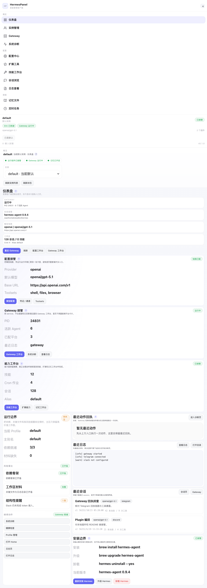
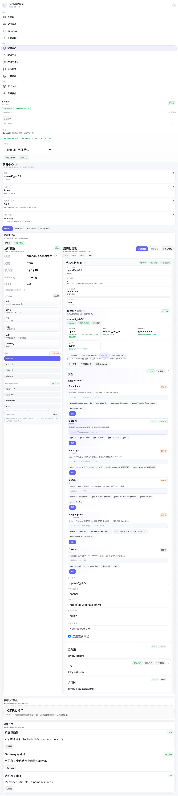
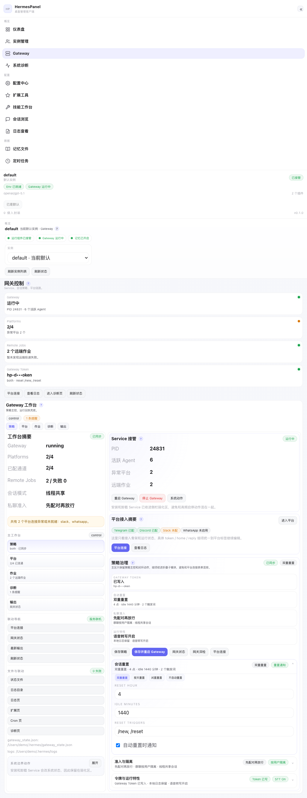
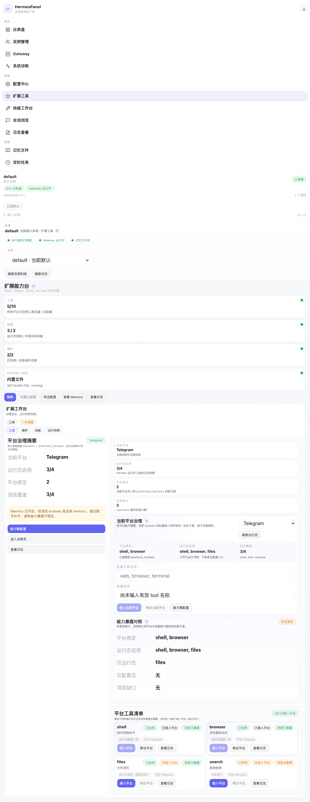
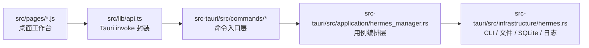

<p align="center">
  
</p>

<h1 align="center">HermesPanel</h1>

<p align="center">
  面向 <a href="https://github.com/nousresearch/hermes-agent">hermes-agent</a> 的桌面管理客户端
  <br>
  聚焦 Hermes 的安装、配置、网关、扩展、技能与运行闭环
</p>

<p align="center">
  <a href="https://github.com/axdlee/hermespanel/releases/latest">
    
  </a>
  <a href="https://github.com/axdlee/hermespanel/actions/workflows/ci.yml">
    
  </a>
  <a href="https://github.com/axdlee/hermespanel/actions/workflows/release.yml">
    
  </a>
</p>

<p align="center">
  
</p>

<table>
  <tr>
    <td width="50%">
      
    </td>
    <td width="50%">
      
    </td>
  </tr>
  <tr>
    <td colspan="2">
      
    </td>
  </tr>
</table>

## 这是什么

HermesPanel 不是 Hermes 的替代品，也不是重写 Hermes 后端。

它做的事情很明确：

- 不修改 `hermes-agent` 源码
- 不接管 Hermes 运行协议
- 不额外起一套常驻服务替代 Hermes
- 只围绕 `hermes` CLI、`~/.hermes`、`config.yaml`、`.env`、`state.db`、`gateway_state.json` 和日志做桌面治理

目标是把原本散落在 CLI、配置文件、日志目录和运行状态里的动作，尽量收成一个更像产品的桌面客户端。

## 当前已经收回客户端内的能力

- 配置中心
  - 模型、Provider、Base URL、Toolsets、Terminal、Memory、消息通道、凭证
  - 结构化写回 `config.yaml` / `.env`
- Gateway 工作台
  - Service 启停
  - 通道接入治理
  - Gateway 策略保存后直接启动 / 重启
- 扩展工作台
  - Tools 平台暴露治理
  - 插件目录、manifest、README、本地导入与删除
  - Memory runtime 对照
- 技能工作台
  - 本地 skill 创建、导入、frontmatter 编辑、正文编辑、删除
  - skill 搜索、预检、安装、更新、审计通过桌面端后端执行
- 诊断 / 日志 / Session / Cron / Memory
  - 统一保留最近回执、日志下钻和运行材料

## 设计方向

当前明确坚持这些约束：

- 少页面，优先做页内主工作台和折叠子模块
- 主操作前置，说明文案弱化
- 配置态和运行态分开摆，不在多个区块重复出现同一组表单
- 能结构化直写的优先结构化直写，不默认把用户甩回命令行
- 真正触及系统边界的动作单独弱化收纳，例如安装、卸载、系统 Service 管理

## 工作台一览

| 工作区 | 主要职责 | 当前状态 |
| --- | --- | --- |
| Dashboard | 总览、入口分发、最近回执、运行材料 | 已形成客户端控制台首页 |
| Config | 模型、Provider、Toolsets、记忆、凭证、通道、迁移 | 高频配置已大幅收回客户端 |
| Gateway | Service、通道、策略、作业、诊断 | 已具备结构化接管和保存后重启闭环 |
| Extensions | Tools、Plugins、Provider、运行对照 | 正在向“治理主卡 + 对照副卡”收敛 |
| Skills | 本地目录、安装治理、文件编辑 | 已形成本地治理 + 安装治理双工作面 |
| Diagnostics / Logs / Sessions / Cron / Memory | 运行排障与材料回放 | 可用，持续压缩层级噪音 |

## 为什么是 Tauri 桌面端

- 需要直接治理本机 `~/.hermes`
- 需要处理 Finder 打开、终端目录、日志目录、状态文件等桌面动作
- 需要打包成真正可分发的安装包，而不是只做浏览器壳
- 需要在不侵入 Hermes 的前提下保留本地管理体验

## 架构



依赖方向保持为：

`pages -> api -> commands -> application -> infrastructure`

这样可以保证：

- UI 不直接知道 `~/.hermes` 目录细节
- 命令层不直接关心文件写入、SQLite 查询或 CLI 输出解析
- 对 Hermes 的侵入始终收敛在底层封装
- 页面改版时不需要碰 Hermes 具体实现

## 下载与发布

Release 工作流已经补到多平台自动构建：

- macOS Apple Silicon
- macOS Intel
- Linux
- Windows 标准包
- Windows 完整包
  - 带离线 WebView2 安装器，适合内网或目标机器缺失 WebView2 的场景

触发方式：

- 推送 `v*` 标签自动发布
- GitHub Actions 手动触发 `Release` 工作流

## 本地开发

### 前置条件

- Node.js 22+
- Rust stable
- 本机已可执行 `hermes`

### 安装依赖

```bash
npm install
```

### 启动桌面端

```bash
npm run tauri:dev
```

### 常用命令

```bash
# 前端构建
npm run build

# 前后端快速校验
npm run check

# 本地调试打包
npm run tauri:build:debug
```

## GitHub Actions

仓库已包含：

- `.github/workflows/ci.yml`
  - macOS / Linux / Windows 三平台检查
  - `cargo fmt`
  - `cargo clippy`
  - `cargo test`
  - `npm run build`
- `.github/workflows/release.yml`
  - `v*` 标签自动发布
  - Tauri 多平台打包
  - Windows 标准包与 Windows 完整包双产物
  - Release Notes 自动更新

## README 截图

本仓库当前 README 展示图位于：

- `docs/screenshots/dashboard-workbench.png`
- `docs/screenshots/config-workbench.png`
- `docs/screenshots/gateway-workbench.png`
- `docs/screenshots/extensions-workbench.png`

macOS 下也保留了一个直接抓取桌面窗口的脚本：

```bash
npm run docs:capture:mac
```

如果脚本失败，通常是终端还没有获得“屏幕与系统音频录制”权限。

## 当前限制

- 少数 Hermes 官方交互式能力仍然依赖底层 CLI 能力执行，但正在逐步收回到桌面端后端封装
- README 展示图当前以工作台页面为主，后续还可以继续补充多实例、技能、诊断等场景
- 部分大页仍在持续收敛，当前策略是优雅拆成页内子模块，而不是继续增加新页面

## 接下来

- 继续收薄 `Extensions / Diagnostics / Skills` 的层级和重复露出
- 把更多“配置态 + 运行态 + 日志态”的闭环动作合并成单个工作台路径
- 持续补 README 展示面、发布说明和多平台安装体验
