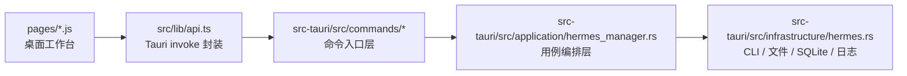

<p align="center">
  
</p>

<h1 align="center">HermesPanel</h1>

<p align="center">
  面向 <a href="https://github.com/nousresearch/hermes-agent">hermes-agent</a> 的桌面管理客户端
  <br>
  0 侵入封装安装、配置、诊断、网关、扩展、技能与运行闭环
</p>

<p align="center">
  <a href="https://github.com/axdlee/hermespanel/releases/latest">
    
  </a>
  <a href="https://github.com/axdlee/hermespanel/actions/workflows/ci.yml">
    
  </a>
  <a href="https://github.com/axdlee/hermespanel/actions/workflows/release.yml">
    
  </a>
</p>

---

## 项目定位

HermesPanel 的目标不是重做 Hermes 本体，而是提供一层更接近 `clawpanel` 体验的本地桌面封装：

- 不修改 `hermes-agent` 源码
- 不侵入 Hermes 的运行时协议
- 不自建另一套后端服务替代 Hermes
- 只围绕 `hermes` CLI、`~/.hermes`、`state.db`、日志和 `gateway_state.json` 做治理

它是 **Hermes 的管理客户端**，不是 Hermes 的替代品。

## 当前方向

这版已经不再停留在“读配置”和“跳终端”的层面，核心工作区正在往真正的客户端闭环推进：

- 配置中心
  - 结构化接管模型、Provider、Base URL、Toolsets、Terminal Backend、Memory、消息通道和凭证
  - 直接写回 `config.yaml` / `.env`
  - 历史迁移动作由客户端后端执行，不再默认 handoff 到 Terminal
- 诊断工作台
  - 直接执行安装、升级、配置体检、Memory 状态、Gateway 状态、Doctor 等动作
  - 统一保留原始 stdout / stderr 和关联日志
- Gateway 工作台
  - 管理 Gateway Service 生命周期
  - 在客户端内接管 Telegram / Discord / Slack / WhatsApp 通道配置
  - 保存后直接回写配置并验证运行态
- 扩展与技能
  - 管理 Tools、Plugins、Skills、Memory Runtime、平台能力暴露
  - 对比“本地文件态”和“Hermes 运行态”
- Profile / Session / Cron / Logs / Memory
  - 围绕 Hermes 的真实目录、会话数据库和调度文件做闭环治理

## 为什么是桌面客户端

HermesPanel 明确选择 **Tauri 桌面端**，而不是纯 Web UI：

- 要直接治理本机 `~/.hermes`、日志、`state.db`、`config.yaml`、`.env`
- 要以 0 侵入方式调用 Hermes 官方 CLI，同时保持页面级别的结构化体验
- 要在 Finder、文件定位、打包分发和本地安装体验上更接近 `clawpanel`

## 工作台总览

| 工作区 | 主要职责 | 当前状态 |
|------|------|------|
| Dashboard | 总览、安装生命周期、快捷闭环、最近输出 | 已形成控制台风格主入口 |
| Config | 模型、Provider、Toolsets、Memory、凭证、通道、历史迁移 | 已大幅收回客户端内 |
| Gateway | Service、平台链路、Gateway 策略、远端作业 | 已具备结构化接管 |
| Extensions | Plugins、Tools、运行态能力面 | 已支持安装/启停/更新类动作 |
| Skills | 本地技能目录、安装治理、文件编辑 | 已形成双栏工作台 |
| Diagnostics | 体检、原始输出、日志联动、修复入口 | 已减少 Terminal 心智 |
| Profiles / Sessions / Cron / Logs / Memory | 运行期治理与回放 | 可用，持续压缩 UI 复杂度 |

## 架构



依赖方向保持为：

`pages -> api -> commands -> application -> infrastructure`

这样可以保证：

- UI 不直接知道 `~/.hermes` 的目录细节
- 命令层不直接关心文件读写、SQLite 查询和 CLI 输出解析
- 对 Hermes 的侵入始终收敛在最底层封装
- 后续如果补更多本地治理能力，页面不需要知道 Hermes 内部结构

## 开发

### 前置条件

- Node.js 22+
- Rust stable
- 本机已可执行 `hermes`

### 安装依赖

```bash
npm install
```

### 启动桌面端

```bash
npm run tauri:dev
```

### 常用命令

```bash
# 前端构建
npm run build

# 前后端快速校验
npm run check

# Rust 测试
cargo test --manifest-path src-tauri/Cargo.toml

# 本地调试打包
npm run tauri:build:debug
```

## 打包与自动发布

项目已经补上了参考 `clawpanel` 的 GitHub Actions 基础链路：

- `.github/workflows/ci.yml`
  - macOS / Linux / Windows 三平台检查
  - `cargo fmt`
  - `cargo clippy`
  - `cargo test`
  - `npm run build`
- `.github/workflows/release.yml`
  - 推送 `v*` 标签自动构建
  - 自动生成并上传 Tauri 安装包
  - 覆盖 macOS Apple Silicon / Intel、Windows、Linux

### 本地构建产物

当前 `src-tauri/tauri.conf.json` 已开启 bundle，发布时会生成对应平台安装包。

常见产物包括：

- macOS: `.app` / `.dmg`
- Windows: `nsis` / `msi`
- Linux: `AppImage` / `deb` / `rpm`

## 截图与 README 资源

为了把 README 做成更接近 `clawpanel` 的展示面，仓库里补了一个 macOS 截图脚本：

```bash
npm run docs:capture:mac
```

脚本会尝试：

1. 自动定位 HermesPanel 窗口
2. 抓取当前窗口区域
3. 输出到 `docs/screenshots/hermespanel-window.png`

如果失败，通常是因为 macOS 没给当前终端开启“屏幕与系统音频录制”权限。

## 当前限制

- 某些 Hermes 官方交互式能力仍然只能通过底层 CLI 封装完成，但目标页已经尽量把它们收回客户端内
- 真实 README 截图自动化依赖 macOS 屏幕录制权限；当前仓库已补脚本，但截图本身可能因系统权限而暂时无法生成
- 少数大页仍偏重，当前策略是优雅拆分为子模块，不继续增加页面数量

## 下一步

- 继续压缩 `gateway / extensions / diagnostics` 的文案和层级噪音
- 把更高频的大页拆成页面内子模块，而不是继续膨胀单文件
- 继续把能结构化接管的 Hermes 设置收回客户端，而不是把用户送回命令行
- 补齐更完整的 README 截图与发布说明
